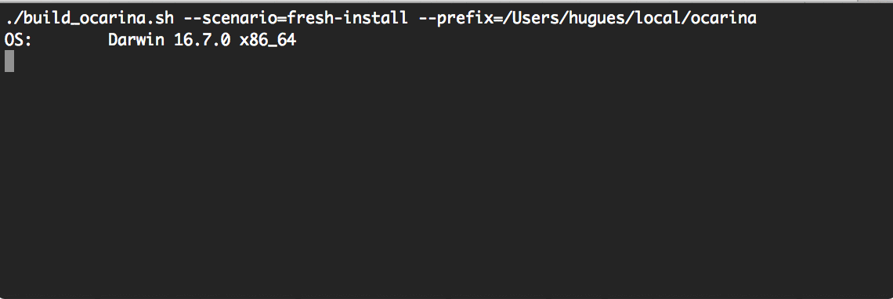

# build_ocarina.sh [](https://codeclimate.com/github/OpenAADL/ocarina-build) [](https://opensource.org/licenses/MIT)

## About [](https://github.com/OpenAADL/ocarina-build/releases)

The `build_ocarina.sh` script is a helper program to get source code,
compile, package and test [Ocarina](https://github.com/openaadl/ocarina) on all supported platforms. It relies
on shell constructs to coordinate various activities:

- fetch Ocarina source, with its runtimes [PolyORB-HI/Ada](https://github.com/OpenAADL/polyorb-hi-ada) and
  [PolyORB-HI/C](https://github.com/OpenAADL/polyorb-hi-c), and the [AADLib](https://github.com/OpenAADL/AADLib) library
- compile Ocarina, and install it in a local directory
- run Ocarina testsuites, and eventually collect coverage metrics
- package Ocarina and its runtime
- upload archives

## Installation

The preferred way to install this script is simply to clone the repository:
 ```
 git clone https://github.com/OpenAADL/ocarina-build.git
 ```

 This will ensure future update of the script in a seamless way.

## Demo

The script aims at automating everything, starting with a fresh-install



### Details

The following
 ```
./build_ocarina.sh --scenario=fresh-install --prefix=$PWD/ocarina_install
 ```

builds a fresh copy of Ocarina and install it in `$PWD/ocarina_install`. This is equivalent to

 ```
./build_ocarina.sh --reset --update --configure --build --prefix=$PWD/ocarina_install
 ```

Multiple scenarios exist for nightly builds, travis-ci testings and others.

## Usage

```
Usage: ./build_ocarina.sh [switches]

General commands
 -h | --help        : print usage
 --version          : return script version, as a git hash
 --self-update      : update this script
 --install_crontab  : install crontab, then exit
 --purge            : delete source and build directories
 --verbose          : return full log of each action

Script commands
 -c | --configure   : configure Ocarina source directory
 -u | --update      : update Ocarina source directory
 -b | --build       : configure, build and install Ocarina
 -t | --run-test    : run Ocarina testsuite, plus runtimes and AADLib
 -p | --package     : package ocarina distribution as tarball
 --upload           : upload archives, see source code for details
 --distclean        : distclean Ocarina build directory
 --remove-prefix    : remove prefix prior to installation
 --release          : release Ocarina on GitHub
 --force            : force build

Update-time options, options to be passed along with -u
 -s | --reset       : reset source directory prior to update
 --remote=<URL>     : Set URL of the Ocarina git repository

Build-time options, options to be passed along with -b
 --prefix=<dir>     : install ocarina in <dir>
 --enable-doc       : enable building the documentation
 --enable-gcov      : enable coverage during ocarina build
 --enable-debug     : enable debug during ocarina build
 --enable-python    : enable Python bindings
 --build-info       : display information on build environment

Scenarios, specific combination of parameters
 --scenario=<name>  : run a specific scenario

 Valid names are coverage fresh-install nightly-build taste travis-ci
 See source code for details.

 Note: a default scenario can be passed using the OCARINA_SCENARIO
 environment variable

Remote build:
 --remote-build=login@host : do a remote build on host through ssh

```

## Authors

* Jerome Hugues, maintainer
* Bechir Zalila, original version
